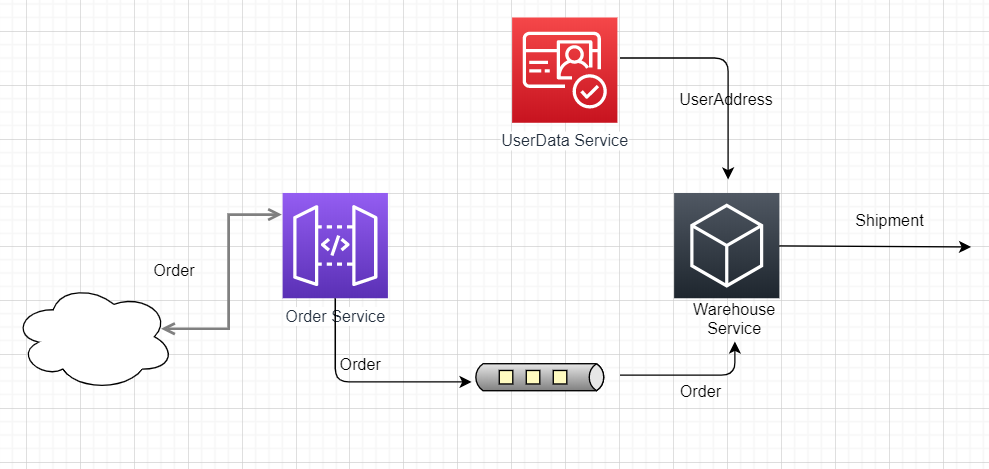

# What is contract testing 
https://docs.pact.io/how-pact-works

# About this Project



This is a bare minimum example of interaction between 3 services
1) Order Service [Java](https://github.ibm.com/sairsule/pact-scenarios/tree/master/spring/order-service), [GO](https://github.ibm.com/sairsule/pact-scenarios/tree/master/GO/order-service)
2) User data Service [Java](https://github.ibm.com/sairsule/pact-scenarios/tree/master/spring/userdata-service),  [GO](https://github.ibm.com/sairsule/pact-scenarios/tree/master/GO/userdata-service)
3) Warehouse service [Java](https://github.ibm.com/sairsule/pact-scenarios/tree/master/spring/warehouse-service),  [GO](https://github.ibm.com/sairsule/pact-scenarios/tree/master/GO/warehouse-service)

When Order-service gets a order, it sends a message to be consumed by Warehouse-service. Warehouse service then parse the message and request Userdata-service to get user's address.

# How to Run and Test services.
Run these services just to understand what they do.
And remember, ablility to test these sevices locally is not the goal. We want to test compatibility of these services without starting them all in single environment.
<details>
  <summary>Prepare environment</summary>
1. Run Kafka. Prefrebly as docker image. 
   
   ```
   cd ./kafka
   docker-compose up -d
   ```
2. Run services
    
    <details>
    <summary>* ##  Java</summary>

      1. Open a new terminal window and execute following
   
        ```
        cd ./spring/userdata-service
        mvn spring-boot:run
        ```

      2. Open a new terminal window and execute following
   
        ```
        cd ./spring/warehouse-service
        mvn spring-boot:run
        ```

      3. Open a new terminal window and execute following


        ```
        cd ./spring/order-service
        mvn spring-boot:run
        ``` 
   
    </details>   
    <details>
      <summary>* ##  GO</summary>
        N/A
    </details>
    <details>
    <summary>* ##  NodeJS</summary>
    Not yet done
    </details>

</details>

<details>
  <summary> Test services </summary>

  Create an Order
   
  1. Using Postman

       POST  http://localhost:8083/orders/

        Headers : 
            
            
            Content-Type: application/json
            
            
        Body :

            
            {
                "orderId" : 1,
                "books" : ["a","b","c"],
                "customerEmail" :"user1@gmail.com"
            }
       

  2. Using Curl
  
            
            curl -H "Content-Type: application/json" -X POST -d '{"orderId" : 1,"books" : ["a","b","c"],"customerEmail" :"user1@gmail.com"}' http://localhost:8083/orders/

           
</details>

# Why Pact 
1. Services can be tested independently.
   
    No need for all services to be available on same environment to do integration testing.

2. Release with confidence.
   
    If pacts test is Pass, changes in service endpoint can be released with surity that contract is not broken.

3.  Pact-broke support for CI/CD pipeline.
   Pact-broker automates the process of sharing and testing pact file. Webhooks are available to test Pact before deploying a service.

4.  List all consuming services
    
    Information of all consuming applications is available at pact-broker. This facilitates communication between teams before modifying api endpoint.
    


# Test the above services with PACT

In the given example services, warehouse service is the consumer service. 
1) It asks recives 'order' details from order-service through messaging channel
2) It requests for 'user address' from user-data service.

PACT is cunsumer driven contract test, so as name suggest lets start with consumer. In this case it's warehouse-service.

> Run both the tests in warehouse-service. This should generate two json files. 

> Share these file with their respective providers.

> Run provider tests to verify if cusumer expectations match provider's response.

